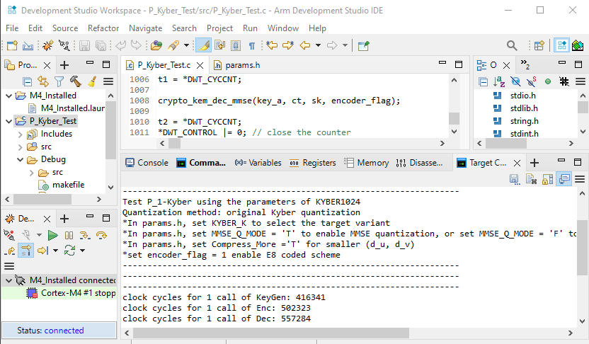
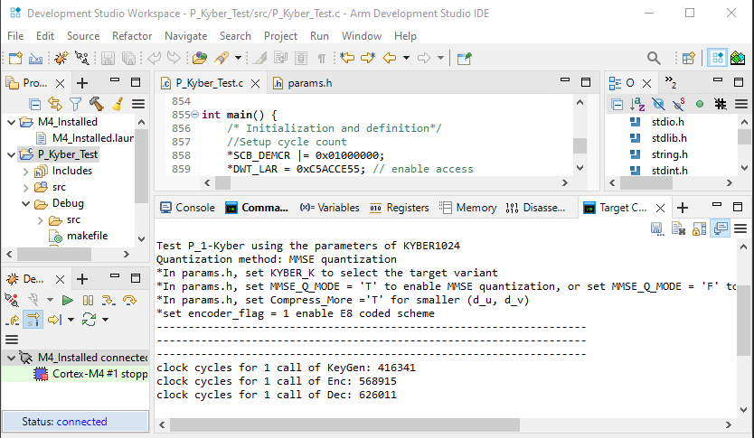

# C Implementation of Coded/Uncoded P-Kyber with MMSE/Kyber Quantization
Flatform: Arm Development Studio (DS) with MPS2_Cortex_M4 debugger

The code is based on the official Kyber reference implementation: https://github.com/pq-crystals/kyber
- P_Kyber_Test.c
  - This main file contains all sub-functions used in P_L_Kyber PKE and KEM.
  - Extra global parameters are defined in params.h.
  - L>1
- P_1_Kyber_Test.c
  - Special case for L=1: Kyber with E8 encoding/decoding and MMSE/Kyber quantization
- randombytes.c
  - Because FVP runs on bare-metal or an undefined OS, randombytes.c currently uses a deterministic test seed for testing only.
  - A secure seed source must be used when available.

### Guide: Importing an Exported Project into Arm Development Studio
#### 1. Installation and Project Import
1. Unzip `stm32_export_project.zip`.
2. Import the folder `P_Kyber_Test` as **Existing Projects into Workspace** in Arm DS.
   - The automatically generated **Makefile** is located in: P_Kyber_Test\Debug\makefile
   - The current **main file** is located in: P_Kyber_Test\src\P_Kyber_Test.c
     - This file is configured for **L = 1**.
     - To run with **L = 8**,  overwrite `P_Kyber_Test\src\P_Kyber_Test.c` with `P_Kyber_Test.c` from the root folder of the repository.

#### 2. Debugger Setup: MPS2-Cortex M4
1. Unzip `M4_Installed.zip`
2. import the folder `M4_Installed` as **Existing Projects into Workspace** in Arm DS

#### 3. Compile and Run (see screenshots below the tables)
1. Build the imported project `P_Kyber_Test` in the **Project Explorer**.  
2. In the **Project Explorer**, open the `M4_Installed` folder and double-click `M4_Installed.launch`. 
3. Run the connected **Cortex-M4** debugger. 

Performance Comparison 1 (L=8): Original KYBER1024 KEM vs. P_8-KYBER1024 KEM in 8 AES Key Exchanges:
| Method                 | KeyGen (CPU Clock Cycles)| Enc (CPU Clock Cycles) | Dec (CPU Clock Cycles) |Ciphertext Size (bytes) |Decryption Failure Rate |
|----------------------- |--------------------------|------------------------|------------------------|------------------------|------------------------|
| KYBER1024 (8 calls)    | 3,330,736                | 4,040,784              | 4,272,704              |12544                   | 2^{-174}               |
| Uncoded P_8-KYBER1024  | 1,982,539                | 1,710,068              | 1,782,147              |2688                    | 2^{-187}               |
| E8 Coded P_8-KYBER1024 | 1,982,490                | 1,713,772              | 1,977,249              |2688                    | 2^{-336}               |
 
Performance Comparison 2 (L=1): Original KYBER1024 KEM (du=11, dv=5) vs. P_1-KYBER1024 KEM (du=10, dv=4) in 1 AES Key Exchange:
| Method                                         | KeyGen (CPU Clock Cycles)| Enc (CPU Clock Cycles) | Dec (CPU Clock Cycles) |Ciphertext Size (bytes) |Decryption Failure Rate |
|------------------------------------------------|--------------------------|------------------------|------------------------|------------------------|------------------------|
| KYBER1024                                      | 416,342                  | 505,098                | 534,088                |1568  (du=11, dv=5)     | 2^{-174}               |
| E8 Coded P_1 KYBER1024 with Kyber Quantization | 416,341                  | 502,323                | 557,284                |1408  (du=10, dv=4)     | 2^{-199}               |
| E8 Coded P_1-KYBER1024 with MMSE Quantization  | 416,341                  | 568,915                | 626,011                |1408  (du=10, dv=4)     | 2^{-204}               |

